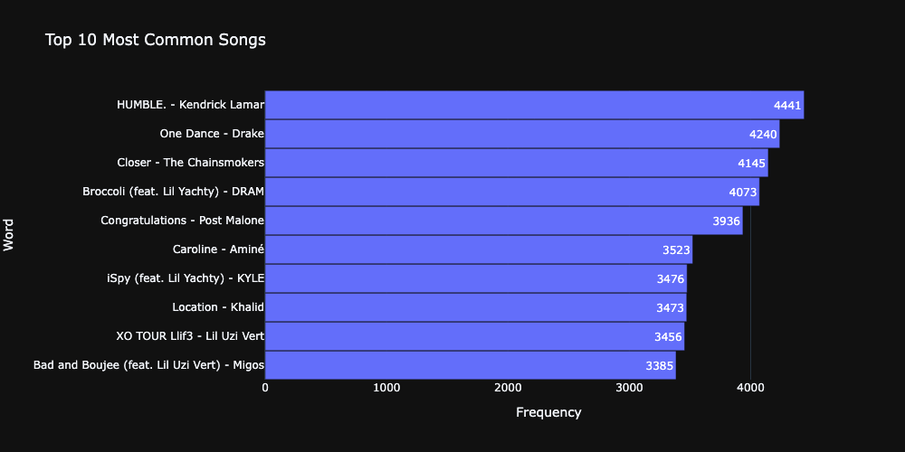
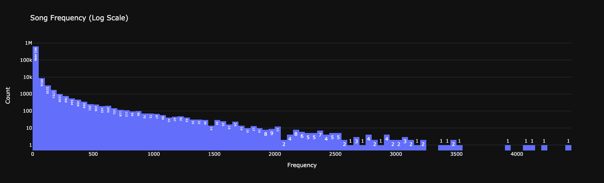
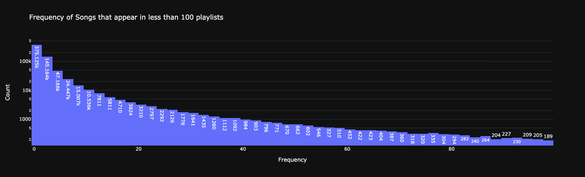
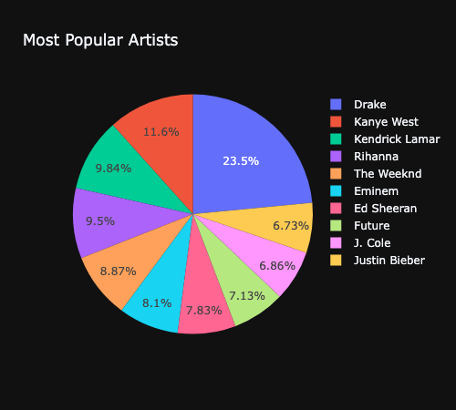
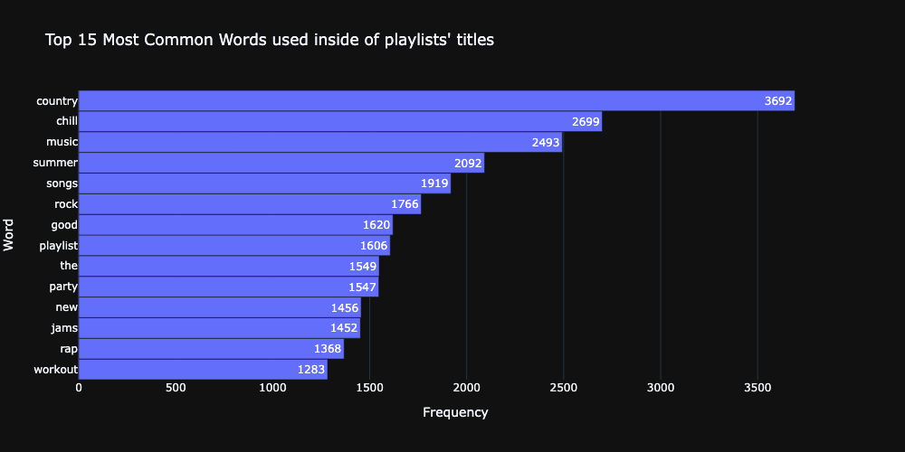

<style>
    @font-face {
    font-family: Gotham;
    src: url(./fonts/Spotify-Font/GothamMedium.ttf);
    }
    *{
        font-family: "Gotham";
    }
    h1{
        color: #1ED760;
    }
    .slidev-layout table {
        padding: 1rem, 0, 1rem, 0 !important;
        font-size: 14px !important;
        width: 30% !important; 
    }

    .col-right {
        padding-top: 3rem;
    }
</style>

# <logos-spotify class="pr-120 w-2xl"/>

<h1 class="text-gray-100">Million Playlist Challenge</h1>
<p>by Domiziano Scarcelli - 1872664</p>

<!--
Test
-->

---

# Introduction
Recommender System for Playlist Continuation

- Started in 2018
- Hosted on AIcrowd
- More than 1000 submissions

<v-clicks>

## Dataset:
- 1 Million Playlists
- 63 Million total songs
- 2 Million unique songs
- 345K unique artists

</v-clicks>

<v-clicks>

Playlists created by users from 2010 to 2017

A song recommender is an essential feature to enable an easy discoverability of new songs.

</v-clicks>

<!--
The Spotify Million Playlist challenge was hosted on AIcrowd and in 2018 and consists in taking a dataset of 1 Million playlists, in order to build a recommender system that will continuate the playlist with coherent tracks. It has gotten more than 1000 submissions.

There are a total of 63 million tracks, with 2 million unique ones and more than 300K artists. The playlists were taken from spotify, and they where created by users January 2010 and October 2017.
-->

---

# Reduced Dataset

Sampled 10% of the playlists
<v-clicks>

-   100K Playlists
-   681,805 Unique Songs
-   110,063 Artists
  
</v-clicks>

<v-clicks>

-   In average:
    -   66 songs per playlist
    -   38 unique artists per playlist

From here, build a distributed recommender system that given a playlist, it recommend new relevant songs that continuate it.

</v-clicks>

<!--
Due to hardware limitations I couldn't work with the full dataset, so I sampled the 10% of it, and worked with 100k playlists. The total number of unique songs becomes around 600k, with 100k artists.
The aim of this project was to build different recommenders systems using pyspark in order to treat the data in a  distributed manner, and see how the performances kept up with the most advanced techniques by the winners of the challenge.
-->

---
css: windicss
transition: slide-up
---

# Data Visualization
<div class="flex justify-center">
    
</div>

<!--
Before diving into the models, we can visualize the data a little bit. Here we can see the top most common songs, which are Humble by Kendrick Lamar and One Dance by Drake.
-->

---
transition: slide-up
layout: center
---

Songs Frequency (Logarithmic scale)



<!--
If we analyze how many times a song appear In a playlist, we notice that most of the songs are unpopular, meaning that 662K songs out of 680K appear in less than 100 playlists.
-->

---
transition: slide-up
layout: center
---

Frequency of songs that appear in less that 100 playlists (Logarithmic Scale)

<div class="flex justify-center">

</div>

Actually, in average each song appears in only 10 playlists!

<!--
We can zoom on the frequency of the songs that appear in less than 100 playlist, and we'll notice that actually most of the songs appear just in a few playlists. This would surely be a problem for simple recommendation algorithms, since those songs won't probably never be recommended.
-->

---
transition: slide-up
layout: center
---

Most popular artists

<div class="flex justify-center">

</div>

<!--
We can also plot a pie chart describing the most popular artist. From here we can see that hip-hop is probably the most popular genre.
-->

---
layout: center
---

Top 15 most used words inside playlist titles

<div class="flex justify-center">

</div>

<!--
From the histogram that describes the distribution of words used in the playlist titles, we can see that there are a lot of country playlists.
-->

---

# Developed Systems
<v-clicks>
  
- User-Based Collaborative Filtering;
- Item-Based Collaborative Filtering;
- Neural Network Approach: 
	- Implemented by using a Denoising Autoencoder developed by the 2nd place solution of the challenge.
  
</v-clicks>

<!--
The models that I developed are three:
- User-Based Collaborative Filtering, considering the playlist as an user to which make the recommendation
- Item-Based Collaborative Filtering, considering the songs as items.
- Denoising AutoEncoder: I took the solution of one of the top solutions of the challenge, and adapt it in order to use the data in a distributed manner.
-->

---

# How was the data structured

<style>
.slidev-code-wrapper::-webkit-scrollbar{
    display: none !important;
  }
</style>

1,000 json files

<v-click>

```json {0-6|7-17|18-28|29-38|39-49}{maxHeight:'450px'}
{
"info": {
		"generated_on": "2017-12-03 08:41:42.057563",
		"slice": "0-999",
		"version": "v1"
},
"playlist": {
        "name": "musical",
        "collaborative": "false",
        "pid": 5,
        "modified_at": 1493424000,
        "num_albums": 7,
        "num_tracks": 12,
        "num_followers": 1,
        "num_edits": 2,
        "duration_ms": 2657366,
        "num_artists": 6,
        "tracks": [
            {
                "pos": 0,
                "artist_name": "Degiheugi",
                "track_uri": "spotify:track:7vqa3sDmtEaVJ2gcvxtRID",
                "artist_uri": "spotify:artist:3V2paBXEoZIAhfZRJmo2jL",
                "track_name": "Finalement",
                "album_uri": "spotify:album:2KrRMJ9z7Xjoz1Az4O6UML",
                "duration_ms": 166264,
                "album_name": "Dancing Chords and Fireflies"
            },
            {
                "pos": 1,
                "artist_name": "Degiheugi",
                "track_uri": "spotify:track:23EOmJivOZ88WJPUbIPjh6",
                "artist_uri": "spotify:artist:3V2paBXEoZIAhfZRJmo2jL",
                "track_name": "Betty",
                "album_uri": "spotify:album:3lUSlvjUoHNA8IkNTqURqd",
                "duration_ms": 235534,
                "album_name": "Endless Smile"
            },
            {
                "pos": 2,
                "artist_name": "Degiheugi",
                "track_uri": "spotify:track:1vaffTCJxkyqeJY7zF9a55",
                "artist_uri": "spotify:artist:3V2paBXEoZIAhfZRJmo2jL",
                "track_name": "Some Beat in My Head",
                "album_uri": "spotify:album:2KrRMJ9z7Xjoz1Az4O6UML",
                "duration_ms": 268050,
                "album_name": "Dancing Chords and Fireflies"
            },
        ],

    }
}
```
</v-click>

<!--
Before diving into the details of each method, let's see how the data was prepared. The dataset is split into 1000 different json files, each one with this structure.

First of all I removed the file info in the header, since it was useless. Then we can see that for each playlist we have many details, such as the `pid`, the number of albums and tracks, the duration and the different tracks. For each tracks we have the song, album and artist uri, other than their name, along with some other information like the position in the playlist and the duration.

Using pyspark I could load all the different json files into a single DataFrame.
-->

---
transition: slide-up
---

# User-Based Collaborative Filtering - Data Preparation
How the playlists are encoded

<v-clicks>

1. Map each song in the playlist to a position.

| track_uri | pos |
|-----------|-----|
| track_1   | 0   |
| track_10  | 1   |
| track_11  | 2   |

</v-clicks>

<!--
Let's start with the first method, the User-Based Collaborative Filtering.

First I mapped each track to a position, this will be useful later.
-->

---

2. Create the encoding vector:

<v-clicks>

- $1$ in the $i$-th position, if the song at position $i$ is in the playlist;
- $0$ otherwise.

$$
p = [0,0,0,0,0,1,0,1,0,1]
$$

This means that the playlist $p$ has the songs with positions $[5, 7, 9]$

Average of 66 songs in a playlist, the vectors are 681,805 dimensional and so they are very sparse ($99.9903\%$ sparseness).

Memory efficiency via pyspark's `SparseVector`, which stores only the indices and the values.

</v-clicks>

<!--
Then I encoded each playlist into a binary vector, where a $1$ in position $i$ means that the song that has mapped the position $i$ is present in the playlist.

Since there are an average of $66$ songs per playlist, and a total of 600k unique tracks, the 600k dimensional vector will be very sparse. This is a common problem for User-Based CF, but is good for memory efficiency since it's possible to encode it into a pyspark `SparseVector`.
-->

---
transition: slide-up
---

## Generate the Recommendations
The pipeline for the recommendation, given the `SparseVector` of a playlist that has to be continuated, is the following:

<v-clicks>

1. Compare the playlist with each other playlist, computing the pair-wise similarity using te Jaccard Similarity between their vectors. This will output the similarity value $\in [0,1]$

| track_uri | vector         | input_vector     | similarity |
|-----------|----------------|------------------|------------|
| track_1   | indices=1,3,4  | indices=0,2,4,10 | 0.2        |
| track_10  | indices=4,6,10 | indices=0,2,4,10 | 0.5        |
| track_11  | indices=3,5    | indices=0,2,4,10 | 0.0        |

</v-clicks>

<v-click>

2. Take the top-$k$ vectors with the highest similarity value;

</v-click>

<v-click>

3. Aggregate the $k$ vectors, averaging them by their similarity value.

</v-click>

<!--
Now, given a SparseVector as the encoding for the input playlists, that is the playlist to continuate, the pipeline is the following:
1. I compare the playlist with each other playlist, computing the pair-wise similarity using te Jaccard Similarity between their vectors. This will output a value between 0 and 1, the higher the better.
2. I take the top-$k$ most similar playlists, where $k$ is an hyperparameter.
3. I aggregate the $k$ playlist vectors, weighting them by their respective similarity value.
-->

---

4. Normalize the values dividing by the sum of the $k$ similarity values.

<v-clicks>


$$
   p_1 = [0,1,1,0,0,1,0] \quad s_1 = 0.3 \\
   p_2 = [0,0,1,0,1,0,0] \quad s_2 = 0.5 \\
   p_3 = [1,0,1,0,1,0,0] \quad s_3 = 0.45 \\
$$

$$
p_{\text{agg}} = [0.45, 0.3, 1.25, 0, 0.95, 0.3, 0] \quad s_\text{sum} = 1.25\\
$$

$$
p_{\text{normalized}} = [\color{green}0.36, \color{white}0.24, \color{green}1.0, \color{white}0.0, \color{green}0.76, \color{white}0.24, 0.0]
$$

</v-clicks>

<v-click>

5. From the normalized aggregated vector, remove the songs that already appears in the input playlist;

</v-click>

<v-click>

6. The top-$n$ indices with the highest values will be the recommended songs;

$$n = 3 \quad \text{recommendations} = \{2: \color{green}1.0, \color{white}4: \color{green}0.76, \color{white}0: \color{green}0.36\}$$

</v-click>

<v-click>

7. Take the `song_uri` of the songs that are mapped into those indices to get the details.


The entire process takes about 30 seconds.
</v-click>

<!--
I then normalize the values dividing them by the sum of the $k$ similarity values.
5. From the resulting vector, I set to 0 the position that have a $1$ in the input vector, in order to avoid recommending songs that are already in the playlist.
6.  The top-n indices with the highest values in the vector will be the positions of the n recommendations. I can just take the spotify uri that is mapped to that position in order to have all the details about the recommendation.
-->

---
transition: slide-up
---

# Item-Based Collaborative Filtering - Data Preparation
Differently from User-Based CF, here the tracks are encoded instead of playlists.

Same principle:

1. Map each playlist into a position.

| pid | pos |
|-----------|-----|
| pid_1   | 0   |
| pid_2  | 1   |
| pid_3  | 2   |

<!--
User based collaborative filtering has some problems, like very high sparseness of the embeddings, and the fact that it suffers from aging very quickly. Let's see how the item-based CF solves those problems:

First of all I map each playlist to a position, just like it was done before with tracks.
-->

---

2. Create the encoding vector for each track:

<v-clicks>

- $1$ in the $i$-th position, if the playlist at position $i$ contains the song;
- $0$ otherwise.

$$
s = [0,0,0,0,0,1,0,1,0,1]
$$

The song $s$ appears in the playlists $5, 7, 9$.

The vector is still very sparse, but its dimensionality is 110,063 instead of 681,805.

Since a playlist appears in an average of $10$ playlists, we have a degree of sparseness of $0.99991\%$ (w.r.t. $99.9903\%$ of the user-based cf).

</v-clicks>

<!--
This time I have to encode tracks instead of playlists. The encoding follows the same principle of the one done by the playlist. An item is encoded in a $d$-dimensional vector, where $d$ is the number of unique playlists (100k) in the dataset. In the position $i$ there is a $1$ if the song is present in the playlist encoded with the position $i$.
-->

---
transition: slide-up
---

## Generate the Recommendations

Given a playlist to continuate, represented as a `DataFrame` containing its songs vectors, the recommendation pipeline is the following:

<v-click>

1. Compute the $k$-nearest-neighbours for each track in the playlist. This will result in a collection of $T$ dataframes, where $|T|$ is the number of songs in the playlist. A dataframe relevant to the track $t$ has a list of $k$ songs, each one with the distance from $t$ in a `distCol` column;

</v-click>

<v-click>

2. Aggregate each Dataframe $\in T$ in order to have a single dataframe.
Since we are sure that the size of $T$ is not big, I first convert the dataframes into python dictionaries
```python
{
    track_uri: distance
}
```

</v-click>
---
transition: slide-up
---

The aggregation produce a python dictionary like this:
    
```json
{
    track_uri_1: [0.2], 
    track_uri_2: [0.25, 0.45], 
    track_uri_3: [0.31, 0.40, 0.36], 
    track_uri_4: [0.1], 
}
```

3. Convert the dictionary into a pyspark `DataFrame`, averaging the values inside of each list

| track_uri   | distance |
|-------------|----------|
| track_uri_1 | 0.2      |
| track_uri_2 | 0.35     |
| track_uri_3 | 0.356    |
| track_uri_4 | 0.9      |

<!--
Aggregate each Dataframe $\in T$ in order to have a single dataframe.
	   Since we are sure that the size of $T$ is not big, I first convert the dataframes into python dictionaries. The aggregation works in this way: for each song in the collection, I put as key the track_uri of that song, and for values a list of all the distances where the song appear. So we will obtain some dictionary like that.
	1. Then we can transform the dictionary back into a pyspark dataframe, averaging the distances inside each list.
	2. -->

---

4. Remove from the `DataFrame` the songs that already are in the playlist

<v-clicks>

5. Order the `DataFrame` by ascending distances, and take the top-$n$ tracks as recommendations.

if $n = 3$, recommendations:

| track_uri   | distance |
|-------------|----------|
| track_uri_1 | 0.2      |
| track_uri_2 | 0.35     |
| track_uri_3 | 0.356    |
| track_uri_4 | 0.9      |

The entire process takes about 30 to 60 seconds.
</v-clicks>

<!--
Before performing the recommendation, we remove from the dataset the songs that already appear inside of the input playlist, in order to not recommend them.

 We recommend the $n$ tracks by ordering the dataframe in ascending order by distance, and taking the top-$n$ tracks with the lowest distance.
-->

---

## K-Neighbours with LSH

<v-clicks>

- Precise $k$-neighbours search is too expensive
- *Locally Sensitive Hashing* with pyspark's `MinHashLSH` class.
- Number of hash tables $= 20$
  - Higher: more precise, less fast
  - Lower: less precise, faster

We can pre-compute the entire set of $k$-nearest neighbour to be even faster

This takes a long time, but has to be done just once
</v-clicks>

<!--
Since there are in average 66 songs in each playlist, and we have to find the $k$ neihbours for each one of them, the precise neighbour search is too expensive. For this I decided to use an approximate search using a Locally Sensitive Hashing algorithm, implemented by pyspark's `MinHashLSH`.
Regarding the number of hash tables, the higher the number, the more precise but less fast; the lower, the less precise but the faster the algorithm is. I tried with both 10 and 20 as values, we will see the results later.

In order to reduce the algorithm inference time, we can pre-compute the list of k-neighbours for each song in advance. This is surely a great idea, but I didn't do it since it took something like a week.
-->

---
css: windicss
transition: slide-up
---

# Neural Network Approach - Introduction
Solution taken by the "Hello World" team, which classified in 2nd place in the challenge.

<v-clicks>

- Denoising Autoencoder that takes Tracks and Artits
- Character level CNN that takes playlist's Title.
- Ensable to make a prediction.

For simplicity, I consider just the Denoising Autoencoder model.

</v-clicks>

<!--
The second place solution of the official spotify challenge was taken by a team called Hello World, which built a recommender system using an ensamble made out of a Denoising Autoencoder, that tries to reconstruct the playlist, and a Character Level CNN in order to recommend songs from the playlist title. For simplicity, I only tried to replicate the Autoencoder part.
-->

---
transition: slide-up
---

## The Autoencoder
<div class="flex justify-center">
    
</div>

<v-clicks>

Input: Concatenation between songs and artists in the playlist, encoded in the following way: 

- **Songs encoding**: the same as User-Based CF;
- **Artists encoding**: $1$ if artist in playlist, $0$ otherwise.

It reconstruct the input playlist. The intuition is that songs with high values in the reconstructed vectors are relevant for the input playlist.

</v-clicks>

<!--
The autoencoder works in this way:
It takes in input the vector encoding of the songs in the playlist, and the artists. The song vector is built exactly as for the other models, and the artist vector follows the same principle, meaning there is a $1$ in the position $i$ if the artist $i$ appears inside of the playlist, $0$ otherwise.

It's trained to reconstruct the input playlist. The intuition is that songs with high values in the reconstructed vectors are relevant for the input playlist.
-->

---

## Noise Generation

Noise to let the model generalize.

<v-clicks>

Training with Hide & Seek technique:

$\text{input} = [\underbrace{0,0,1,0,1,1,}_\text{playlist}\underbrace{0,1,0}_\text{artists}]$

Each iteration the song vector or the artist vector are masked.

</v-clicks>

<v-click>

Mask playlist: $\text{input}  [\underbrace{\color{red}0,0,0,0,0,0}_\text{playlist}\underbrace{,\color{green}0,1,0}_\text{artists}]$

</v-click>

<v-click>

Mask artists: $\text{input} = [\underbrace{\color{green}0,0,1,0,1,1}_\text{playlist}\underbrace{,\color{red}0,0,0}_\text{artists}]$

</v-click>

<v-clicks>

The model can learn intra-relationship between artists and tracks.
  
Dropout with probability $p$ that a node is kept in the network sampled between $(0.5, 0.8)$  as regularization, and to let the model learn inter-relationship between tracks and between artists.

</v-clicks>


---
transition: slide-up
---

## Training

_Petastorm_ to generate DataLoader from pyspark `DataFrame`. 

<v-clicks>

At training time, the model is fed with mini-batches of $100$ playlists.

The loss function is the Binary Cross Entropy loss:
$$
\mathcal{L}(\mathbf{p}, \hat{\mathbf{p}})=-\frac{1}{n} \sum_{\mathbf{p} \in \mathbf{P}} p_i \log \hat{p}_i+\alpha\left(1-p_i\right) \log \left(1-\hat{p}_i\right)
$$

where $p_i$ is the input concatenated vector, and $\hat{p}_i$ is the reconstructed vector.

$\alpha = 0.5$ is the hyperparameter weighting factor. Balances the importance between observed values ($1$s) and missing values $0$s in the input vector.

Same hyperparameters used by the authors of the paper, but smaller learning rate, since I have a smaller dataset to work with.

The whole training (pretrain + train) took about 12 hours on CUDA GPUs.

</v-clicks>

---

## Validation
In order to do _Early Stopping_, and save the model parameters that achieve the best metrics, at the end epoch the model is evaluated on a validation set.

<v-click>

This is done for both the pretraining (tied weights) and training.

</v-click>
---
transition-slide-up
---

# Performance Evaluation
How is the test set built

<v-clicks>

- Different splits for models with and without training
- If there is no training, split at track level
- It there is training, split at row level, and then at track level

</v-clicks>

---
css: windicss
---

## User-based and Item-based CF

<v-clicks>

Split at track level (75%, 25%)

Original `DataFrame`

| pid | vector                  |
|-----|-------------------------|
| 0   | indices=1,3,4,10,11,23  |
| 1   | indices=4,6,10,12,34,56 |
| 2   | indices=3,5,6,8,9,10    |

<div class="flex py-10">
  <div class="flex-1">

    Training set (75% of the tracks)

    | pid | vector             |
    |-----|--------------------|
    | 0   | indices=1,3,10,23  |
    | 1   | indices=4,10,56    |
    | 2   | indices=3,6,8, 10  |
    |-----|--------------------|

  </div>
  <div class="flex-1">

    Test set (25% of the tracks)

    | pid | vector          |
    |-----|-----------------|
    | 0   | indices=4,11    |
    | 1   | indices=6,12,34 |
    | 2   | indices=5,9     |
    |-----|-----------------|

  </div>
</div>

</v-clicks>

---
transition: slide-up
---

## Neural Network Based

Create 3 `DataFrames`:  Train, Validation, Test

Original `DataFrame`

| pid | vector                      |
|-----|-----------------------------|
| 0   | indices=1,3,4,10,11,23      |
| 1   | indices=4,6,10,12,34,56     |
| 2   | indices=3,5,6,8,9,10        |
| 3   | indices=1,2,5,8,10,11       |
| 4   | indices=0,1,5,8,11,21,34,53 |

---

<v-clicks>

<div class="flex py-10">
  <div class="flex-1">

    Training Set
    
    (98.5K playlists)

    | pid | vector                      |
    |-----|-----------------------------|
    | 0   | indices=1,3,4,10,11,23      |
    | 1   | indices=4,6,10,12,34,56     |
    | 2   | indices=3,5,6,8,9,10        |
    |-----|-----------------------------|

        
  </div>
  <div class="flex-1">

    Validation Set

    (500 playlists)

    | pid | vector                      |
    |-----|-----------------------------|
    | 3   | indices=1,2,5,8,10,11       |
    |-----|-----------------------------|

  </div>

  
</div>

<div class="flex justify-center">

<div>

    Test Set 
    
    (1,000 playlists)

    | pid | vector                      |
    |-----|-----------------------------|
    | 4   | indices=0,1,5,8,11,21,34,53 |
    |-----|-----------------------------|
  </div>

</div>

Then I split at track level the Evaluation and Test set, in order to compute evaluation metrics

No need to further split the Training set. 

</v-clicks>

---

# Evaluation Metrics
Evaluation metrics used for Performance Evaluation
<v-clicks>

$G$ is the ground truth (tracks in Test set) and $R$ is the set of recommended tracks

- R-precision: ratio between correct and incorrect recommended songs
$$
\text{Rprec} = \frac{G \cap R_{1:|G|}}{|G|}
$$

- Normalized Discounted Cumulative Gain: how much the correct recommended songs are up in the list. We define $rel_i = 1$ if the track with index $i$ is in the ground truth, otherwise $rel_i = 0$.
$$
NDCG = \frac{DCG}{IDCG} \\
$$
$$
DCG=rel_1+\sum_{i=2}^{|R|} \frac{r e l_i}{\log _2 i} \quad \text{and} \quad IDCG=1+\sum_{i=2}^{|G \cap R|} \frac{1}{\log _2 i}
$$

</v-clicks>

---

# Performance Comparison

Evaluation on 1,000 playlists

<v-click>

- User-Based CF
  - $Rprec = 0.1242$, $NDCG = 0.3041$

</v-click>

<v-click>

- Item-Based CF:
  - 10 Hash Tables: $Rprec = 0.0847$, $NDCG = 0.242$
  - 20 Hash Tables: $Rprec = $, $NDCG = $

</v-click>

<v-click>

- Denoising Autoencoder:
  - $Rprec = 0.1327$, $NDCG = 0.334$

</v-click>

<v-click>

Winners of the challenge:
- $Rprec = 0.220$, $NDCG = 0.3858$

</v-click>

<v-click>

User-Based better than Item-Based because of lower sparsity!

</v-click>

---

# Conclusions

In general both User-Based and Neural Netork Based have good performances.
<v-clicks>

- User-Based, even if simple, has good results;
- Item-Based could have done better if less sparsity;
- Denoising Autoencoder could have learnt better patterns if less unpopular songs. 
  - Better than all the others because of faster inference time.

</v-clicks>

---
css: windicss
---

# Web Application Demo

<div class="flex justify-center">
    <video width="800" height="400" controls autoplay>
        <source src='/videos/demo.mp4' type="video/mp4">
    </video>
</div>

---
css: windicss
---

<div class="flex flex-col justify-between items-center h-full w-full">
<div class="flex justify-center items-center flex-1">
<h1>
Thank you for the attention
</h1>
</div>

<div class="flex flex-col justify-start items-start w-full">

<h4>
References
</h4>

<ul>
<li>
<a href="https://www.aicrowd.com/challenges/spotify-million-playlist-dataset-challenge">AIcrowd Spotify Million Playlist Challenge.</a>
</li>
<li>
<a href="url">hello world! [Yang et al.]</a>
</li>
</ul>


</div>

</div>
